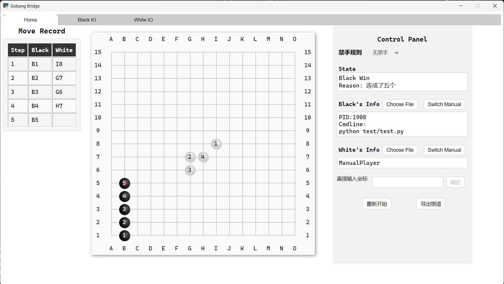

# Gobang Bridge

程序设计课程的五子棋比赛采用的是人工比赛，耗时耗力，还不能得出更能反映真实棋力的排名。为了让的五子棋比赛效率更高，结果更有说服力，我们开发了一个五子棋自动对战平台，希望可以实现自动对战，节约大家时间，同时还可以实现所有人互相对战，并以此为排名得到更为准确的结果。

## Quick Start

Windows系统可以直接使用，对于Linux系统，需要安装依赖，以Ubuntu 22.04为例：
``` bash
sudo apt install python3-gi python3-gi-cairo gir1.2-gtk-3.0 gir1.2-webkit2-4.1
```


两种选择:

可以从release中直接下载打包好的可执行文件

也可以下载源码并使用python运行src/start.py文件，需要安装pip包pywebview，可以参考pywebview的[说明文档](https://pywebview.flowrl.com/guide/installation.html)

若想打包源代码为单个可执行文件，可以使用pyinstaller，命令为
``` bash
pyinstaller --noconfirm --onefile --windowed --add-data "src/assets:assets/"  "src/start.py" --icon "src/assets/img/icon.ico"
```


## 未来计划


- 完善禁手判断，确保比赛的公平性
- 制定一个异常处理流程，对各种异常情况进行捕获并判定胜负
- 实现所有人与所有人对战的功能（可以仅命令行界面），自动比赛完成后，保存所有历史结果，计算个人棋力得分（算法可以参照Elo rating system）


##  界面介绍



- 顶端

  - `Home`：首页
  - `Black IO`：黑色方程序文件的输入输出
  - `White IO`：白色方程序文件的输入输出

- 界面 

  - `Move Record`：移动过程记录

  - `棋盘`：四周为坐标，中间为棋盘，存在人类玩家的情况下，鼠标点击可以为该方落子。

  - `Control Panel`：

    - `禁手规则`：可选择是否使用禁手规则。

    - `State`：显示当前对局状态，获胜(退出)原因。

    - `Info`：显示当前黑白方状态，包含人和机器两种模式，选择机器人对局点击`Choose File`选择编译好的C程序文件；选择人类玩家则点击`Switch Manual`，默认为人类玩家。人类玩家有直接鼠标点击落子和输入坐标落子两种方式，下为坐标输入格式：

```
B1
```

      即表示在B列1行落子。

    - `重新开始`：在当前玩家选取的情况下重新开始对局。

    - `导出棋谱`：生成本局比赛到目前为止的状态信息，包含禁手规则`ForbiddenRule`，获胜玩家`WinPlayer`，对局情况`wincode`，黑方玩家`black`，白方玩家`white`，落子情况`movelog`。（关于日志导出的具体说明见后）


## 输入输出规范

此程序对黑方白方的程序输入输出作了如下规范：

1. 启动检测：

   在输入黑方白方的函数（如用于输入黑方白方的`scanf`函数前)，前的两条语句应该为：

```C 
printf("READY"\n);
fflush(stdout);
```

   程序片段示例

```C
printf("READY"\n);
fflush(stdout);
//必须紧跟着输入函数
scanf("%s",player);
//黑方：BLACK；白方：WHITE
fflush(stdout);
```

2. 输入及输出规范

   > 程序应当输出该步骤的落子，并接受对方的下一落子

   对于棋子坐标的传输，规范统一采用下列格式化字符串形式：

```C
" MOVE %c%d\n"
//MOVE前有一个空格，即读入坐标的函数应写为如下格式
char rowAsChar;int col;
scanf(" MOVE %c%d",&rowAsChar,&col);
int row=rowAsChar-'A'+1;col=col;
//其中行为row,列为col
```
	对于一次交互过程：黑方机器先手，其先输出字符串

```
MOVE A3//表明黑方机器在坐标A3处落子，输出的时候，字符串MOVE前没有空格
```

   通过`Gobang_Bridge.exe`程序，白方机器获取到黑方机器的输出，然后给出白方机器的落子，输出字符串

```
MOVE B3//表明白方机器在B3处落子
```

   且对于输出同学们编写的C语言程序中的用于输出落子信息用的函数：

```C
printf,puts等 
```
   
   其输出格式规定为

```C
printf("MOVE %c%d\n",row+'A'-1,col);
//MOVE前没有空格
//row为行，col为列
```

   且其下一条语句必须为

```c
fflush(stdout);
```


   > 原理部分（省流可跳过）：`fflush(stdout)`的作用本质为清空标准输出`stdout`的缓冲区，本程序采用标准输入输出实现白方与黑方的交互，需保证每次传入的格式为`"MOVE(%d,%d)\n"`

**下为一段示例程序，输入输出规范可参考此程序**：

```C
#include <stdio.h>
#include <string.h>
char s[100];
int main()
{
	puts("READY\n");			 // 输出READY表示初始化完成
	fflush(stdout);				 // puts和printf之后都要刷新缓冲区
	gets(s);					 // 读取自己的颜色
	if (strcmp(s, "BLACK") == 0) // 判断自己是黑方还是白方
		printf("MOVE H8\n");	 // 如果是黑方，就先下一步
	fflush(stdout);
	while (1)
	{
		int row = 7, col = 7;char c;
		// 读取对手下棋的坐标，注意scanf的空格很重要，不然会读到换行符等
		scanf(" MOVE %c%d", &c, &row);
		col = c - 'A' + 1;

		// 然后根据对手的坐标下一步棋，这里只是简单的下在对手的右边
		row = row;
		col = col > 14 ? 1 : col + 1;

		// 输出自己的下棋坐标
		// 必须从新行开始输出
		// printf("MOVE %d %d\n", row, col);
		printf("MOVE %c%d\n", col + 'A' - 1, row);
		fflush(stdout);
	}
	return 0;
}
```


## 棋谱日志介绍

- `forbidden`：禁手规则

  - 0：无禁手
  - 1：有禁手
  
- `WinPlayer`：获胜方

  - `true`：黑方
  - `false`：白方

- `Wincode`：对局状态（胜利状态）

  - `Still-Playing`：仍在进行
  - `Five in a row`：五个连成一串
  - `Non-empt position`：重复落子（即落子到了已经有棋子的位置）
  - `Draw`：平局
  - `Timeout`：超时（未采用）

- `Black`&`While`：

  - `PID`：进程号
  - `CmdLine`：文件路径
  - `ExitCode`：终止码

- `Movelog`

  - `true`：黑方
  - `false`：白方
  - `rol`，`col`行与列


## 附加调试

> 可以使用PID号进行附加调试，感兴趣的同学可以使用

## 命令行参数

本程序也可以使用命令行参数运行。

本程序命令行参数表如下：

- `-b`：黑方玩家（不填默认为人类玩家）（填写文件路径）

```shell
示例 ./Gobang_Bridge -b "path/black.exe" 
# 黑方为机器，白方为人类
```
  
- `-w`：白方玩家（不填默认为人类玩家）（填写文件路径）

```shell
示例 ./Gobang_Bridge -w "path/white.exe" 
# 黑方为机器，白方为人类
```

```shell
示例 ./Gobang_Bridge -b "path/black.exe" -w "path/white.exe" 
# 黑白方均为机器
```

- `-l`：日志导出（`log`）：后面跟存储路径。

  >  日志写入模式为附加，不是覆盖。

```shell
./Gobang_Bridge -l "log.json"
```

- `-f`：禁手规则制定：

```
0:无禁手
1:有禁手
```
